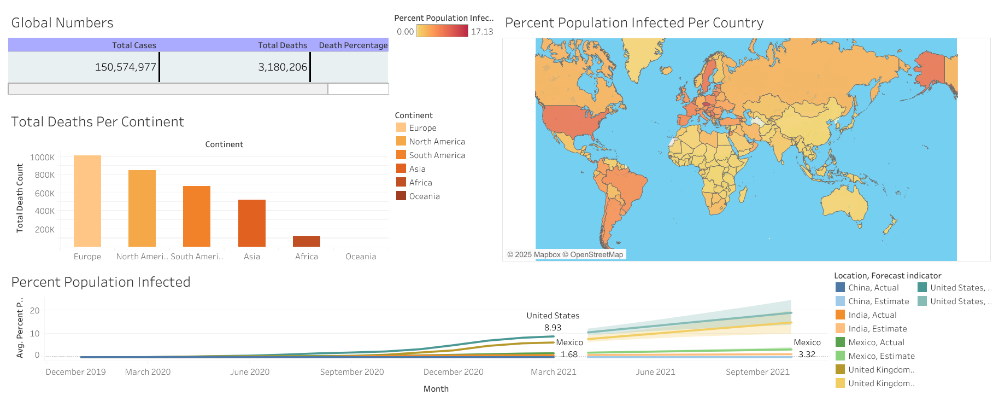

# COVID-19-Data-Exploration-and-Dashboard

---

## 📘 Project Overview 

This project explores global COVID-19 data to uncover trends in infections, deaths, and vaccinations.   It combines **Excel for data cleaning**, **SQL for data exploration and transformation**, and **Tableau for visualisation** — creating a complete data analysis workflow from raw data to insights.

---

## 🧰 Tools & Technologies
- **SQL Server (T-SQL)** – for data exploration, joins, and view creation  
- **Excel** – for data cleaning and preprocessing  
- **Tableau** – for dashboard visualisation and storytelling 

---

## 🧪 Key Skills Demonstrated
- Data Cleaning and Preparation  
- SQL Aggregations, Joins, and Window Functions  
- Common Table Expressions (CTE)  
- Temporary Tables and Views  
- Tableau Dashboard Design and Interactive Visualisation  

---

## 🗄️ SQL Data Exploration

The SQL portion of this project focuses on analyzing **infection rates, death percentages, and vaccination progress** globally and by continent.

📂 **SQL File:**  
[`CovidPortfolioProject.sql`](https://github.com/Llinvile/COVID-19-Data-Exploration-and-Dashboard/blob/main/CovidPortfolioproject.sql)

This script includes:
- Calculation of **death percentages** and **infection rates per population**  
- Rolling vaccination totals using **window functions**  
- Implementation of **CTE's**, **temporary tables**, and **views**  
- Data prepared specifically for Tableau connection  

### 🧱 Database Setup Summary
- **Database Name:** `PortfolioProject`  
- **Tables Used:**  
  - `CovidDeaths$`  
  - `CovidVaccinations$`  
- **Data Source:** [Our World in Data – COVID-19 Dataset](https://ourworldindata.org/covid-deaths)

To recreate:
1. Import the datasets into SQL Server as separate tables.  
2. Run the provided `.sql` script in the `/sql` directory.  
3. Connect Tableau to the `PercentPopulationVaccinated` view for visualisation.

---

## 📊 Insights
- Countries with **high population density** show the highest infection rates.  
- **Death percentages** vary significantly by continent.  
- **Vaccination rollout trends** align with declining infection growth over time.  

---

## 🖼️ Tableau Dashboard

The Tableau dashboard visualises key global metrics derived from the SQL analysis.  
It provides an interactive interface to explore:
- Infection and Death Rates by Continent  
- Percentage of Population Infected  
- Vaccination Progress by Country



🌐 **View the Interactive Dashboard:**  
🔗 [COVID-19 Dashboard on Tableau Public](https://public.tableau.com/app/profile/llinvile.de.jongh/viz/CovidDashboard_17609176542880/Dashboard1)

---
## 📂 Project Structure

```text
COVID-19-Data-Exploration-and-Dashboard/
├── data/                         # Cleaned and prepared datasets used in the analysis
│   └── CovidDeaths.xlsx          # Excel file used for initial data cleaning and preprocessing
├── sql/                          # SQL scripts used for data exploration and transformation
│   └── CovidPortfolioProject.sql # Main SQL script with CTEs, temp tables, and analytical queries
├── tableau/                      # Tableau workbook and visualisation files
│   └── CovidDashboard.twbx       # (Optional) Tableau workbook — consider using public link instead
├── images/                       # Images and previews used for documentation and presentation
│   └── dashboard-preview.png     # Screenshot of the Tableau dashboard for quick reference
└── README.md                     # Project documentation explaining purpose, process, and insights

